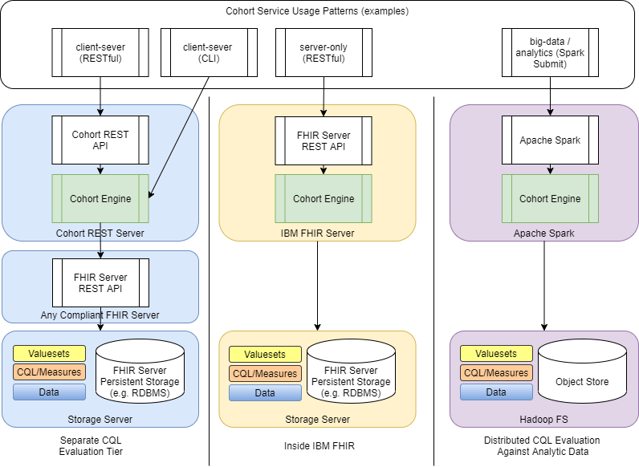

# Deployment Models

The quality-measure-and-cohort-service project endeavors to provide clinical query capabilities using the HL7 Clinical Quality Language (CQL) in a variety of deployment models in order to support the needs of a wide-range of solutions. Development has focused on three possible deployment models which will be outlined in this document. Follow the links for each mode for more detail on how to use the cohort evaluation capabilities in that deployment model. 

1) [client-server mode](client-server-guide.md) where the server provides data and the client owns the CQL evaluation
2) [server-only mode](sever-only-guide.md) where the server provides both the data retrieval and CQL evaluation capabilities
3) [big-data/analytics mode](spark-user-guide.md) where an application running under Apache Spark does both the data retrieval and CQL evaluation

For both the [client-server](client-server-guide.md) and [server-only](sever-only-guide.md) modes of operation, data is assumed to be in HL7 Fast Healthcare Interoperability Resource (FHIR) format version R4. For the [big-data/analytics mode](spark-user-guide.md) of operation, data is assumed to be in tabular format and accessible via the [Spark SQL DataFrame/DataSet APIs](https://spark.apache.org/docs/latest/sql-programming-guide.html).

In [client-server mode](client-server-guide.md), the server can be any FHIR server that implements the FHIR [RESTful API](https://www.hl7.org/fhir/http.html) such as the high-performance IBM FHIR server [IBM FHIR server](https://github.com/IBM/FHIR). The client can be a provided command line interface (CLI), service calls to the provided RESTful cohort-services API, or directly embedded into a consuming application via the provided cql-engine application programming interfaces (APIs).

In the [server-only mode](sever-only-guide.md), the CQL engine capabilities are embedded into an [IBM FHIR server](https://github.com/IBM/FHIR) and exposed via standard operations defined in the [FHIR Clinical Reasoning Module](http://www.hl7.org/fhir/clinicalreasoning-module.html). Several extension operations are also implemented from the in-development [FHIR Clinical Practice Guidelines (CPG) Implementation Guide (IG)](https://build.fhir.org/ig/HL7/cqf-recommendations/).

In the [big-data/analytics mode](spark-user-guide.md), the CQL engine is embedded into an Apache Spark application. The application handles loading and grouping data that resides in unordered tabular data files and Spark handles distribution of workload so that data access and CQL evaluation is processed through all available computing resources. Many CQL expressions can be evaluated for each input context and output of each is written back out as tabular data for each unique data context.

