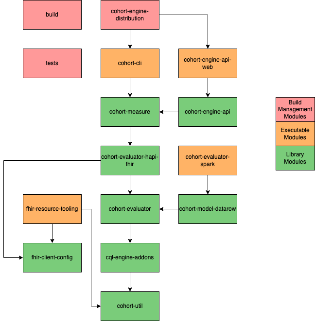

# Project Layout
This project is made up of multiple modules that supply various features for different methods of cohort execution.

This is a simplified dependency diagram for the project.
Transitive dependencies are omitted even when a module directly depends on said transitive dependency.

Each module has a README that briefly describes its purpose in the project.

## Dependency Diagram

The above diagram showcases a simplified view of the dependencies between each module within the project.
All "transitive" dependency usages are omitted to keep the diagram easily readable.

#### Build Management Modules
Build Management modules exist to help configure and package the project during a build.
There's no meaningful source code to be found in these projects.

#### Executable Modules
Executable Modules are intended to produce useable programs for the end user.
The code found here is purpose built for the executables provided by each module.
While a developer can depend on these modules directly, the value gotten from doing so may be limited.

#### Library Modules
Library Modules contain the bulk of the cohort codebase and are intended to be used as dependencies for executable projects.
These modules can rarely be executed on their own, but provide valuable APIs for cohorting development.
