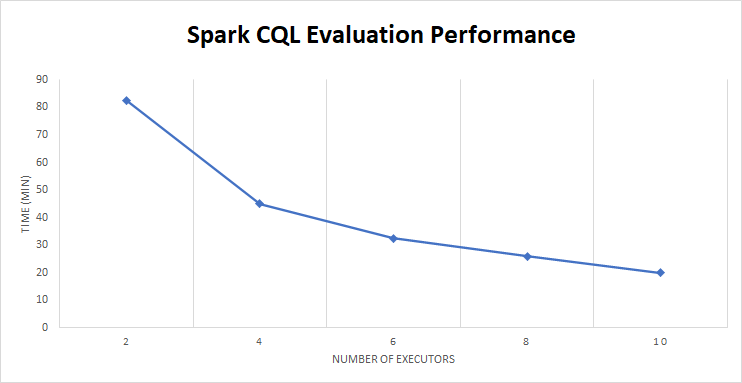

# Spark Application Performance

This document describes the test framework used internally to test the CQL on Spark application, the performance we observed during testing, and introduces some techniques for monitoring and tuning parameters that will affect runtime. Included at the end are some tips for CQL authors on how to create CQL queries that perform better than others.

## Test Setup

Apache Spark 3.1.2 / Hadoop 3.2 running in IBM Cloud under IBM Kubernetes (K8S) Service
1 K8S cluster, 18 worker nodes
	4 core, Intel Xeon Processor (Skylake, IBRS) 2.6 ghz
	16 GB RAM

	spark.default.parallelism           50
	spark.driver.memory                 1G
	spark.driver.memoryOverhead         1G
	spark.executor.memory               4G
	spark.executor.memoryOverhead       1G
	spark.eventLog.enabled              true
	spark.executor.instances            4

Data stored in deltalake format under IBM Cloud Object Store (COS)

	Region-local COS bucket
	Direct endpoints used between K8S cluster and COS

2 aggregation contexts

	context 1:
		245,000 records joined 1:n with three related tables
			join1    32,000,000
			join2    25,000,000
			join3    80,000,000
	context 2: 
		24,000,000 records, no joins

5 CQL expressions in 5 libraries
	- No use of valuesets
	
	2 CQL expressions for context 1
	3 CQL expressions for context 2

## Performance

## IO

Each data table is read from disk each time it is included in a context definition. If the same table is used in more than one context definition, it will be read more than one time. Most of the CQL logic we've been testing with has been fairly simple and the majority of the program's runtime is spent reading and regrouping data. If there is a need to reduce the overall runtime of a single program execution, users might find it beneficial to reduce the number of context definitions included in a single run. This can be done using the `-a` program argument for a single context definition file or by simply dividing the context definitions into separate files and referencing the appropriate file in the `-d` program option for each execution.

It is also important to consider how many partitions are used to store the data on disk. For some Spark applications, data partitioning by column can be very beneficial because it allows a Spark application querying that column to skip reading data that will not be used. Because a single execution of the the SparkCqlEvaluator application will perform potentially many CQL operations with many different column filters, figuring out the correct set for a single data read would be a challenging task that we have chosen to leave out for now. The SparkCqlEvaluator reads all data from all partitions of all tables needed in the evaluation. The number of input partitions read from those tables can affect the overall performance of the application. A more compact table can lead to better application performance. This is especially true when the source data is stored in Delta lake format where history is maintained using separate data partitions. It is a Delta Lake [best practice](https://docs.delta.io/latest/best-practices.html#compact-files) to compact your data on a regular basis. 

## Memory

The SparkCqlEvaluator reads all data into memory for processing. Care is taken to select only the columns that are necessary to support the CQL logic being evaluated, but, as more columns are used by the CQL logic, more executor memory will be necessary to store that data. The amount of memory required will vary by application, but we've been using 4GB memory and 1GB memoryOverhead as a baseline for our executor pods. Finer grained tuning can be achieved by monitoring the job during execution using the Spark Web UI (http://driver-node:4040) or after the fact using Spark event logging and a Spark History Server (see full Spark docs [here](https://spark.apache.org/docs/latest/monitoring.html)). 

If you do not have enough memory to store the application data, you will most likely see executors dying/being killed off. During our testing using Spark on Kubernetes, we observed a situation where executors that ran out of memory would get restarted indefinitely by the driver pod. It is important to monitor for node failures and take appropriate action when executors are continually dying. Most likely, you will need to kill the job, add more memory, and then restart.

If your application has exceeded the amount of memory available and you are not able or choose not to increase the memory, you may consider using the `spark.default.parallelism` configuration option to chunk the input data into more partitions which will reduce the amount of data in memory at any given time. Spark defaults vary based on configuration, but in most production scenarios will default to a number of partitions equal to the number of cores on all executor nodes (see docs [here](https://spark.apache.org/docs/latest/configuration.html)). Our testing has shown that increasing parallelism helps manage the memory requirements per pod. We have been testing with parallelism set to 50, but that is also a value that should be tuned to the exact application needs. If the parallelism number is set too high, it will lead to longer processing times. Ideally, we want to store as much partition data in memory as possible given the constraints of the runtime environment.

Pay attention to the note above about allocation of additional non-JVM memory using the memoryOverhead configuration option. We found in our testing that simply increasing the driver and executor memory was not the right approach and often resulted in wasted resources while still encountering failures. With the additional configuration of the `spark.[driver|executor].memoryOverhead` options, we were able to reduce JVM-memory by a significant amount while smoothing out the memory-related failures. We are using a 1:4 approach between memory and memoryOverhead in our testing, but, again, we recommend you do additional tuning to achieve best possible values for those settings.

## CPU/cores

For the sample dataset we use in our testing, we found that 4 executors was a safe minimum and that adding additional executors two at a time had a linear impact on performance. Testing with just 2 executors demonstrated a significant drop off in performance from 4 executors and is not recommended.

## CQL optimizations

### Inline codes vs.ValueSets 

The CQL language provides a number of language elements related to terminology. There is a `Code` class that wraps a code value, a codesystem identifier (e.g. URI), a codesystem version, and a display value, a `Concept` class that wraps a list of codes defined inline in the CQL library, and a `ValueSet` class that wraps a list of codes defined external to the CQL logic. CQL authors might be tempted to use the `Concept` class and an expression such as `[ModelObject] o.code in MyConcept.codes`, but this is not recommended because it will cause the CQL engine to do a linear lookup of codes in the data against codes in the concept. If a ValueSet is used within a filtered retrieve operation instead (e.g. `[ModelObject: code in MyValueSet]`), this goes through a different execution path where we've been able to plug in indexing of codes to achieve faster runtime performance. This is useful for large codesets, as well as, common situations where data might be compared against codes from multiple codesets (e.g. `[ModelObject: MyValueSet1] union [ModelObject:MyValueSet2]`, etc.). 

### Boolean short-circuit

The third-party CQL engine that powers much of the cohort and quality measure service made a deliberate choice to evaluate all parts of boolean AND/OR logic regardless of whether or not it would be possible to know the answer ahead of time and exit early (aka short-circuit). The cohort and quality measure service provides enhanced evaluators for boolean AND/OR logic that will short-circuit evaluation if the answer is known early. For almost all use cases, this is going to be the desired behavior and nothing special needs to be done to enable this behavior. There are some rare cases where this might not be the desired behavior, though, and consumers should reach out with their specific requirements as needed.
